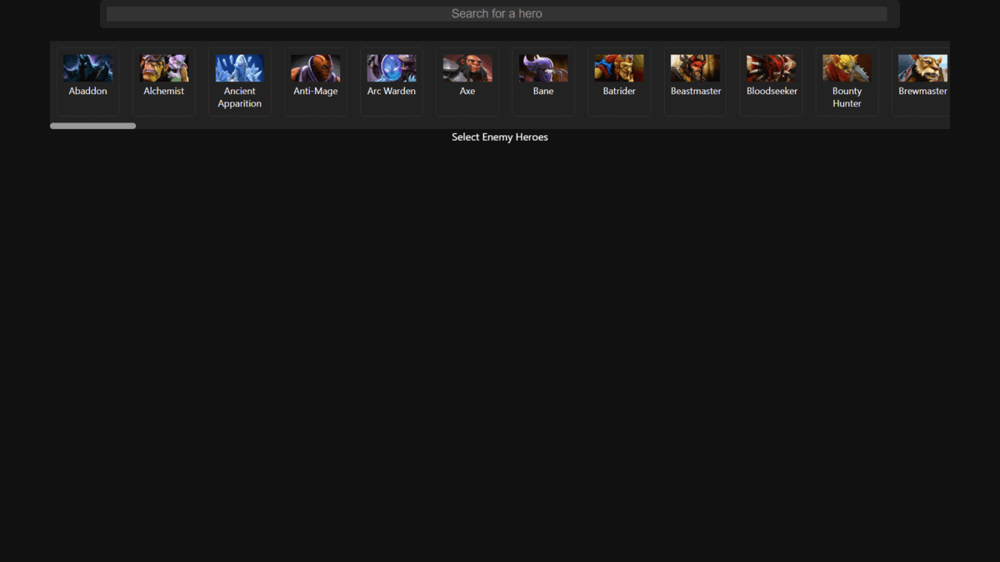

# **Dota 2 Counter Picker**
The Dota 2 Counter Picker App scrapes and displays data from dotabuff in an simple and intuitive way so that the user can visualise which heroes are best against the enemy heroes selected.

The app is deployed at https://dota2-counter-picker.onrender.com/. Please note that it may take some time to load (approximately 2 to 5 minutes) as it is hosted on a free instance that puts the app to sleep if it is unused for 15 minutes.

<p align="center">
    <a href="https://dota2-counter-picker.onrender.com/">
        
    </a>
</p>

## **Table of Contents:**

1. <a href="#1-about">About</a>
2. <a href="#2-running-the-main-branch-locally">Running the Main Branch Locally</a>

## <a>**1. About**</a>

The Dota 2 Counter Picker app utilizes web scraping to gather all the current hero data, images, and counter data from dotabuff. On sync the counter data is fetched from the past week, but can be modified by adjusting the filter (DBUFF_FILTERS = '?date=week') located in constants.py to their liking. Once the data is gathered, it can then be displayed on the frontend web application.

Users can select up to 5 enemy heroes to see how other heroes fare against them. The search bar can also be used to quickly find and select enemy heroes. For each counter hero, the app displays individual advantage, as well as "Cumulative Advantage" and "Average WR vs Enemies". Additionally, the app provides sorting functionality for each of these counter hero metrics.

## <a>**2. Running the Main Branch Locally**</a>

### Prerequisites
Before running the main branch of the application locally, ensure that you have the following installed:
- Python
- Node.js
- NPM
Additionally, you will need credentials for a Google Cloud service account with the Google Drive API enabled. Save the credentials file as "creds.json" in the base directory.

### Installing Python Requirements
To install the Python requirements, run the following command in the root directory of the application:
```
pip install -r requirements.txt
```
It is recommended to create and activate a virtual environment before running the command.

### Configuring the React App
Before running the React app, you need to configure it to point to the local server. To do this, follow these steps:
1. Navigate to `dota2-counter-picker\dota2-counter-picker-frontend\src\components\HeroPicker.js.`
2. Change `"https://dota2-counter-picker.onrender.com/getHeroData"` to `"http://127.0.0.1:5000/getHeroData"`.

### Building the React App
To build the React app, navigate to the `dota2-counter-picker\dota2-counter-picker-frontend\` directory and run the following commands:
```
npm install
npm run build
```

### Running the Application
To start the local server, navigate back to the root directory and activate the virtual environment (if created). Then run the following command:
```
python app.py
```
You can access the application by opening a web browser and visiting `http://127.0.0.1:5000/`.